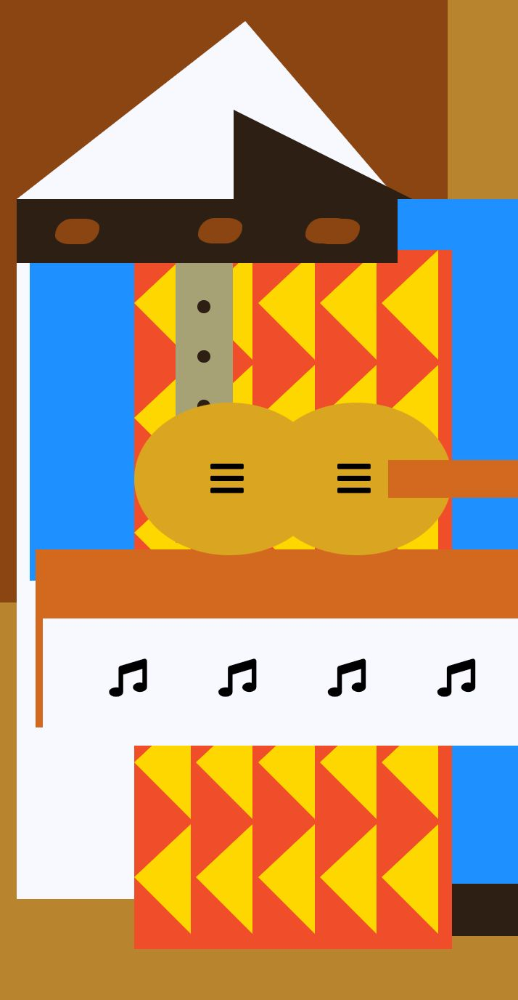

# 🎨 Pintura de Picasso

Aplicación web interactiva inspirada en el estilo artístico de **Pablo Picasso**, donde el usuario puede explorar una composición visual creativa utilizando tecnologías web.

Este proyecto fue desarrollado como práctica de **HTML, CSS y JavaScript**, enfocándose en el diseño visual y la manipulación de elementos en la página.

---

# 🚀 Demo del proyecto

👉 Probar la aplicación

[](https://carlosdm121.github.io/pinturadepicasso/)

---

# 🖥 Vista previa



---

# 🛠 Tecnologías utilizadas

<p align="left">


</p>

---

# 📌 Descripción

Este proyecto presenta una **composición gráfica inspirada en el arte de Picasso**, creada mediante elementos HTML y estilos CSS.

El objetivo del proyecto es practicar:

- estructura de páginas web
- estilos visuales con CSS
- posicionamiento de elementos
- diseño creativo en el navegador

---

# ⚙️ Funcionalidades

✔ Composición visual inspirada en el cubismo  
✔ Diseño estilizado con CSS  
✔ Proyecto simple para practicar diseño web  
✔ Compatible con navegadores modernos  

---

# 📂 Estructura del proyecto

```
pinturadepicasso
 ├── index.html
 ├── style.css
 ├── script.js
 └── README.md
```

---

# ▶️ Cómo ejecutar el proyecto

Clonar el repositorio:

```
git clone https://github.com/carlosdm121/pinturadepicasso.git
```

Abrir el archivo:

```
index.html
```

en tu navegador.

---

# 👨‍💻 Autor

Carlos Martinez  

GitHub  
https://github.com/carlosdm121

---

⭐ Si te gustó este proyecto puedes darle **Star** al repositorio.
